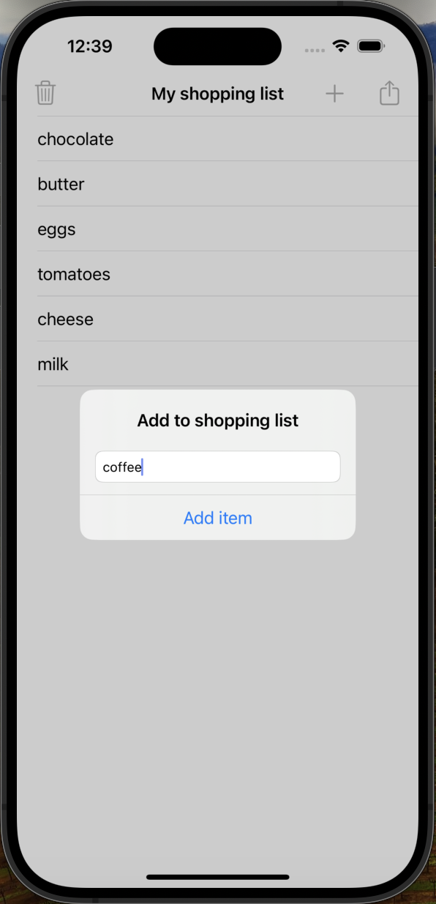
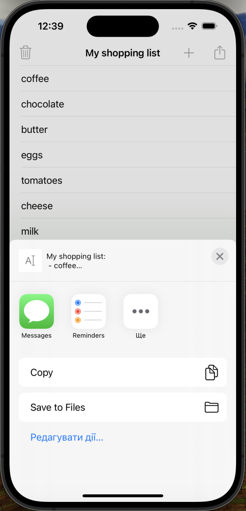

Here is a formatted README file for your Challenge2 project:

# Shopping List

Shopping List is a simple iOS app that allows users to create and manage their own shopping lists.

## Table of Contents

* [Features](#features)
* [Screenshots](#screenshots)
* [Requirements](#requirements)
* [Usage](#usage)
* [Code Overview](#code-overview)

## Features

* Allows users to add, edit, and delete items from their shopping list
* Includes a share feature to share the shopping list with others
* Includes a delete feature to clear the shopping list

## Screenshots

  
   
  <em>Shopping List Screen</em>

  
   
  <em>Add Item Screen</em>

  
   
  <em>Share List Screen</em>

## Requirements

* iOS 12.0+
* Xcode 12.0+
* Swift 5.0+

## Usage

1. Launch the app.
2. Tap the "Add to shopping list" button to add a new item.
3. Type in the item you want to add and tap the "Add item" button.
4. To delete an item, tap on the item and then tap the "Delete" button.
5. To share your shopping list, tap the "Share list" button and select the sharing method.
6. To clear your shopping list, tap the "Delete this shopping list?" button and confirm.

## Code Overview

### ViewController

* Manages the shopping list and displays it in a table view.
* Handles user interactions, such as adding, editing, and deleting items.
* Includes a share feature to share the shopping list.

## Possible Improvements

* Add filtering or sorting options for the shopping list.
* Implement animations for adding and deleting items.
* Add a search function to find specific items in the shopping list.
* Improve the user interface design.
